# AI Auditor: LLM-powered security analysis for Burp Suite

**Author**: Richard Hyunho Im ([@richeeta](https://github.com/richeeta)) at [Route Zero Security](https://routezero.security)

**Contributor**: Vinaya Kumar ([@V9Y1nf0S3C](https://github.com/V9Y1nf0S3C))

## Description

AI Auditor is a **Burp Suite Professional / Enterprise** extension that sends HTTP traffic and Burp Scanner context to **large language models** and turns the model output into **Scanner-style findings** (severity, confidence, narrative, remediation hints).

**Providers:** OpenAI, Google Gemini, Anthropic Claude, OpenRouter, **xAI (Grok)**, and **local** OpenAI-compatible servers (e.g. **LM Studio**). You can pick different models for **automatic** work (passive scans, Scanner-issue follow-ups, optional Proxy/Repeater capture) versus **manual** work (right-click scans, PoC generation, “Explain me this”, issue deep-dives).

**How it fits into Burp:** passive scan integration, optional audits when Burp reports Scanner issues, optional high-level review of in-scope traffic, and optional **Proxy** (and **Repeater**) response capture when using a **local** model—so day-to-day browsing can be analyzed without routing full Scanner/crawler volume through the LLM. Settings, API keys, and prompts persist across restarts.

**Install:** download the pre-built fat JAR from [`releases/ai-auditor-jar-with-dependencies.jar`](https://github.com/patrick-projects/AIAuditor/raw/main/releases/ai-auditor-jar-with-dependencies.jar) (raw link) or a [GitHub Release](https://github.com/patrick-projects/AIAuditor/releases/latest). In Burp: **Extender** → **Extensions** → **Add** → extension type **Java** → select the JAR → **Next** (leave options default unless you know you need otherwise).

### Issues Reported by AI Auditor
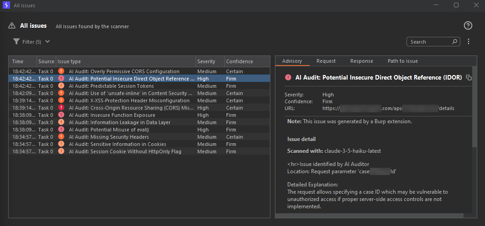

### Scan Selected Text
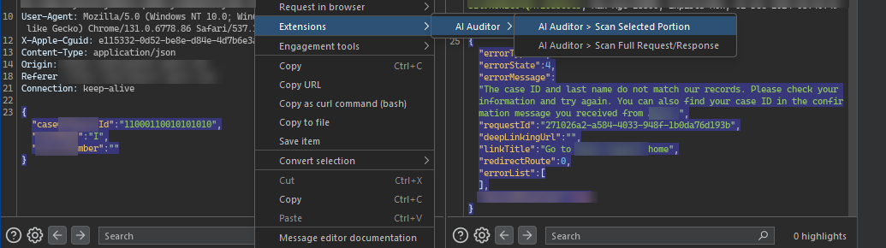

### Scan Request/Response
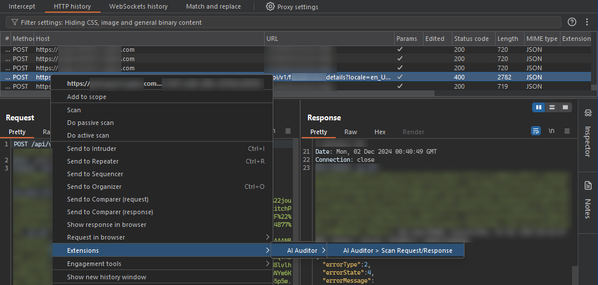


### Updates in AI Auditor v1.1 with screenshots

<details>
<summary><strong>Local LLM (Ollama terminal or LM Studio)</strong></summary>

**Ollama + Gemma 4 26B** — for **M4 Max with 64 GB RAM**, copy-paste in Terminal:

```bash
brew install ollama
ollama serve
```

In a second terminal (leave `ollama serve` running):

```bash
ollama pull gemma4:26b
```

If `pull` fails, upgrade Ollama to the latest version. Model details: [ollama.com/library/gemma4](https://ollama.com/library/gemma4).

In **AI Auditor → Connect**: set **Local LLM URL** to `http://127.0.0.1:11434/v1`, click **Validate** (the button beside the URL — checks `GET /v1/models`), set **Cheap Local LLM (Bulk Proxied Traffic)** to `local/gemma4:26b`, optionally set **Premium Model for PoCs**, click **Get Latest Models** if the dropdown is empty, then **Save Settings**.

**LM Studio (GUI)**

1. Run LM Studio and ensure its IP + port are reachable from Burp Suite.  
2. Load a model in LM Studio for request/response analysis.  
3. Enter the LM Studio URL in **Burp Suite → AI Auditor → Connect** (often `http://127.0.0.1:1234/v1`).  
4. Click **Validate** next to **Local LLM URL** — results appear in **Event Log** (lower-left).  
5. Choose a **local/…** model in **Cheap Local LLM (Bulk Proxied Traffic)** and/or **Premium Model for PoCs**.  
6. (Optional) Set the proxy to `127.0.0.1:8080` to inspect traffic.  
7. Highlight a request or text → **Right-click → Extensions → AI Auditor**.  
8. View findings in **Target → Issues** or the **Event Log**.

<kbd>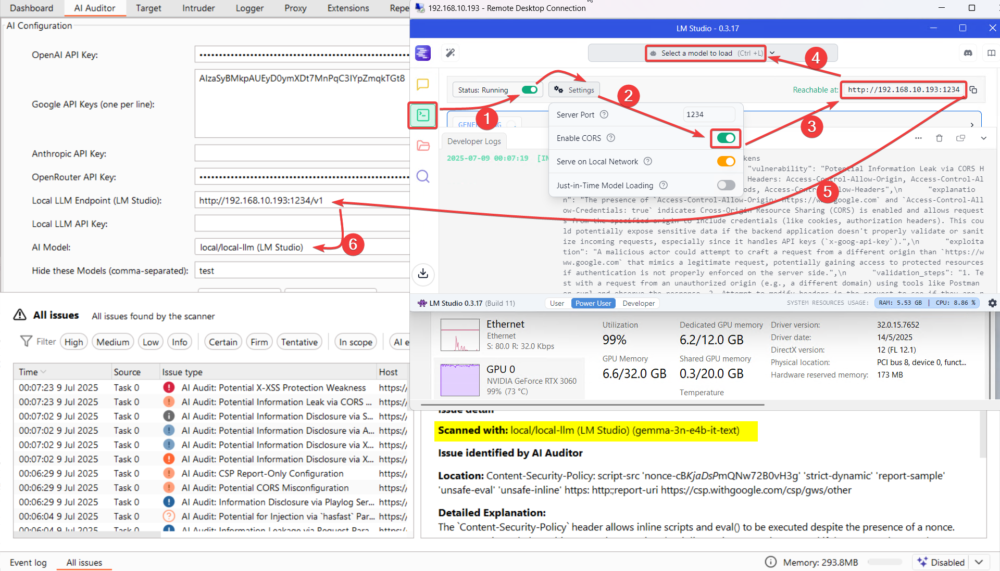</kbd>  

<kbd>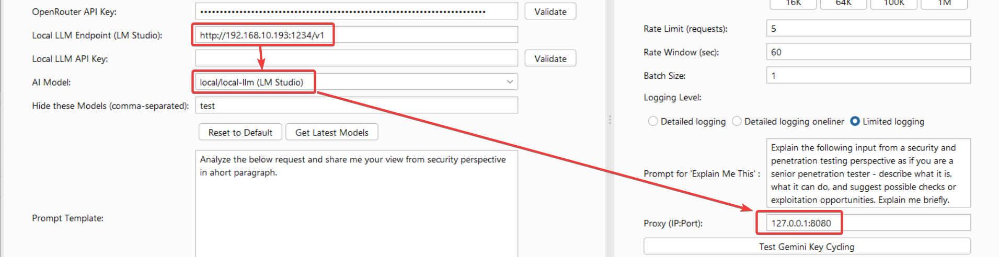</kbd>  

<kbd>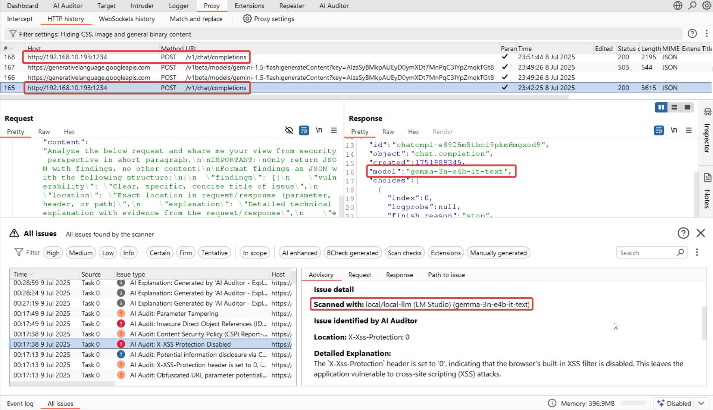</kbd>

</details>


<details>
<summary><strong>Proxying AI Auditor Traffic through Burp</strong></summary>

Configure **Proxy (IP:Port)**—e.g., `127.0.0.1:8080`—to route AI Auditor requests through Burp or another interception tool.

> *Note:* Traffic from the **Validate** button is not proxied yet.

<kbd>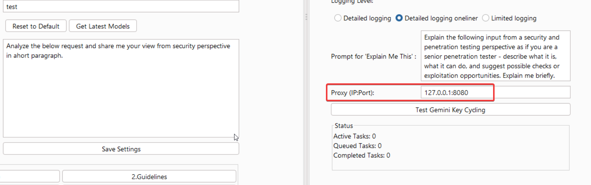</kbd>  

<kbd>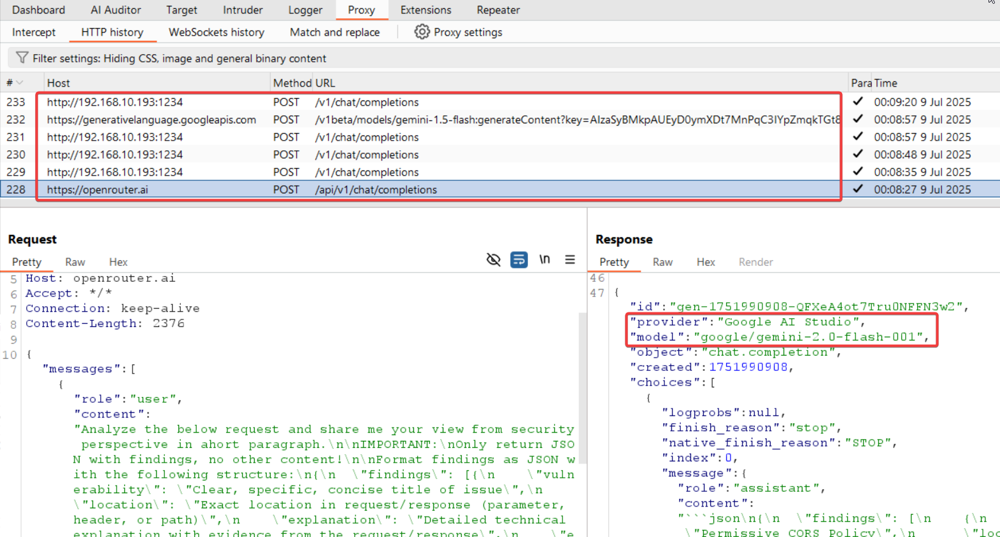</kbd>

</details>


<details>
<summary><strong>Gemini API Key Rotation</strong></summary>

1. Enter multiple Google API keys (one per line) and click **Validate**.  
2. (Optional) Click **Test Gemini Key Cycling** to simulate rotation.  
3. (Optional) Check output under **Extension** logs.  
4. During scans, keys rotate automatically on quota hits—verify in logs or proxy.

<kbd>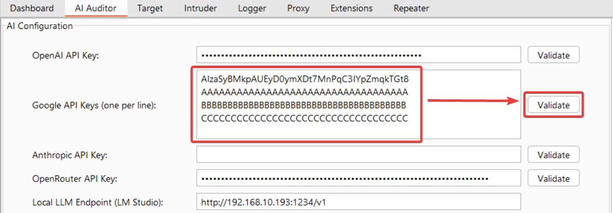</kbd>  

<kbd>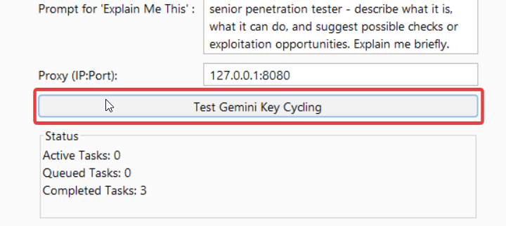</kbd>  

<kbd>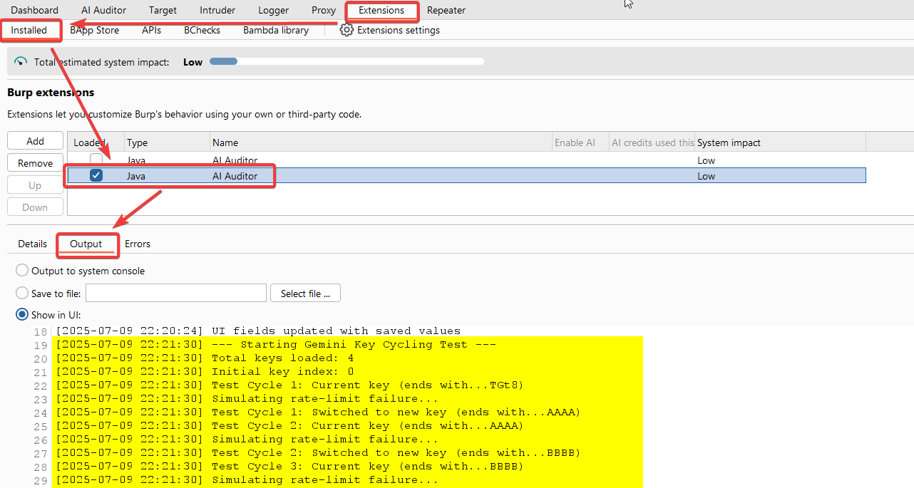</kbd>  

<kbd>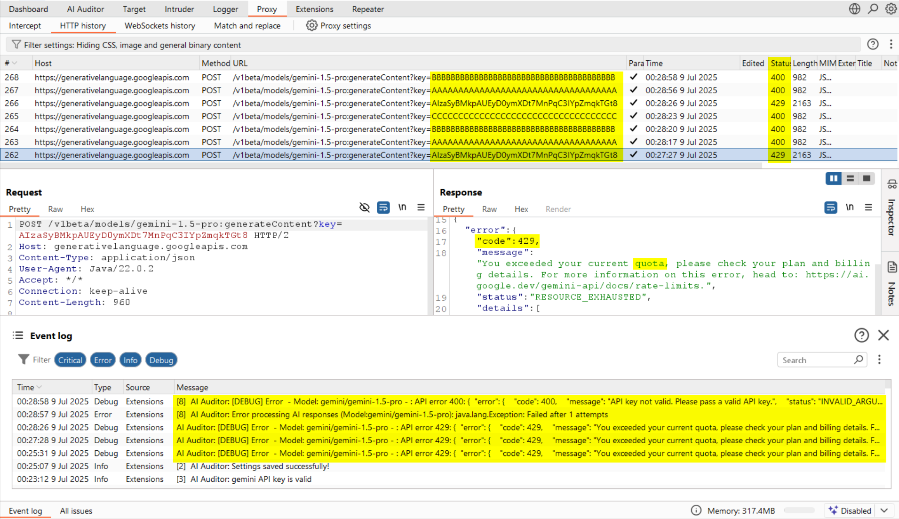</kbd>  

<kbd>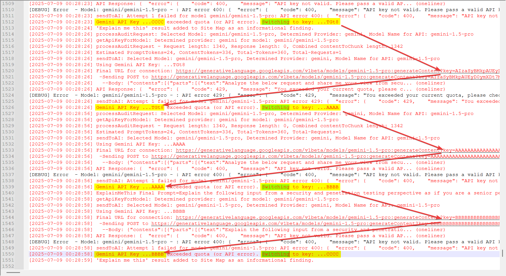</kbd>

</details>


<details>
<summary><strong>Event Log Migration</strong></summary>

Validate-operation results and many debug messages are now sent to the **Event Log** instead of pop-ups; critical errors also surface in **Extension Error Output**.

<kbd>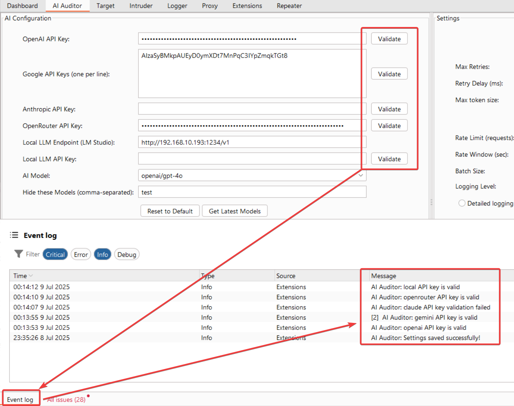</kbd>  

<kbd>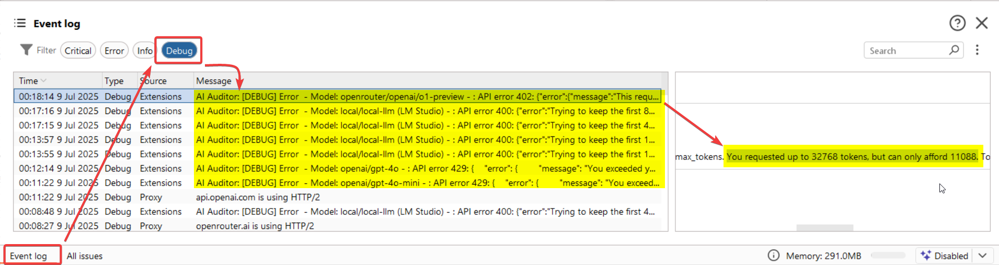</kbd>  

<kbd>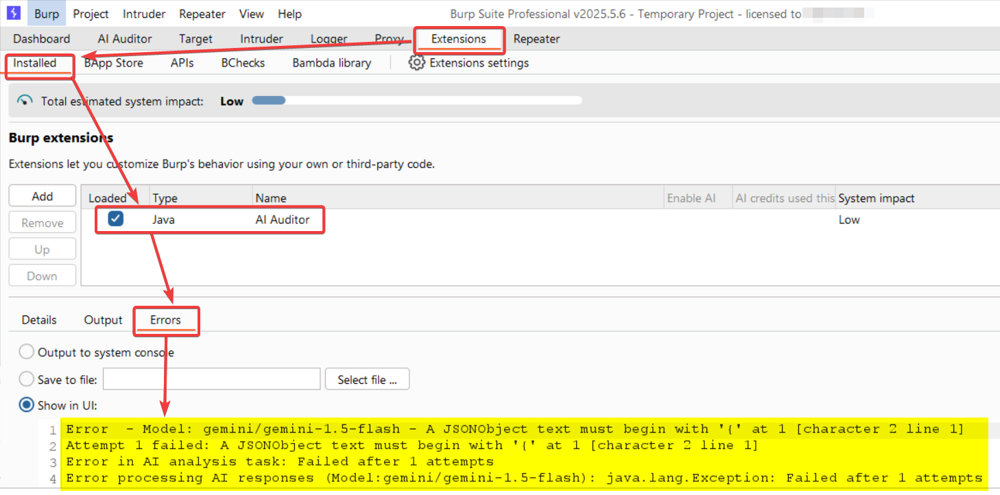</kbd>

</details>


<details>
<summary><strong>Dynamic Model Loading & Filters</strong></summary>

- Default models appear on start-up.  
- Click **Get Latest Models** to fetch new ones when APIs are set.  
- Add model names to **Hide these Models** to exclude them.

<kbd>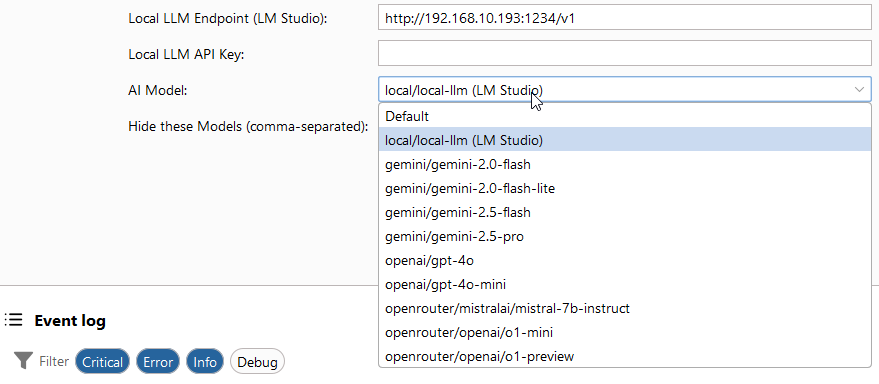</kbd>  

<kbd>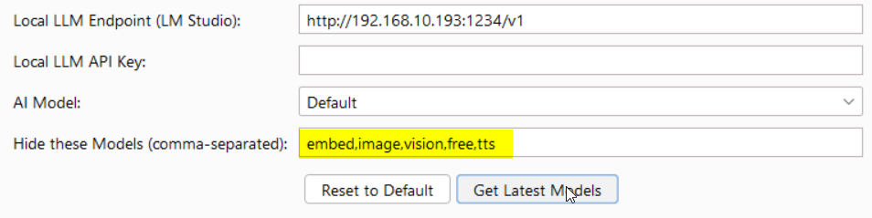</kbd>  

<kbd>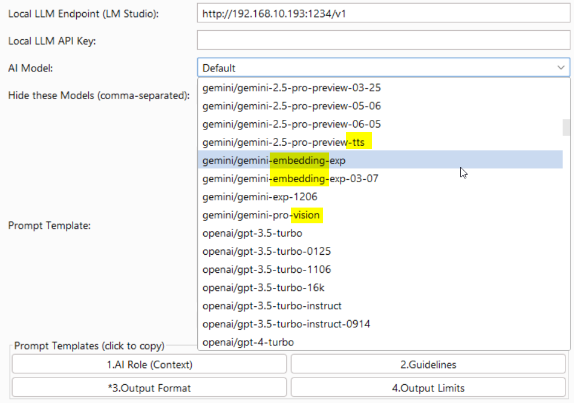</kbd>  

<kbd>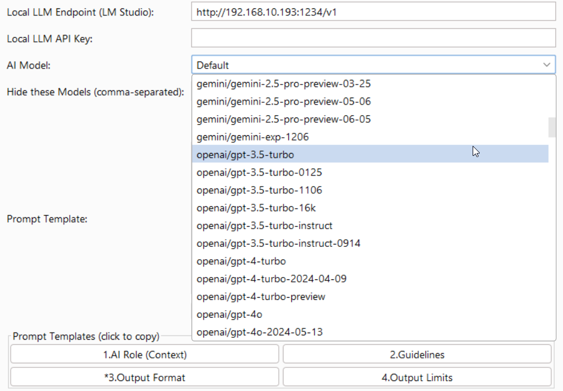</kbd>

</details>


<details>
<summary><strong>Dedicated Prompts for Analysis & “Explain Me This”</strong></summary>

Separate text boxes fir differnt prompts are are available for scanning and for the **Explain Me This** context menu; explanatory output is logged as an informational issue.

<kbd>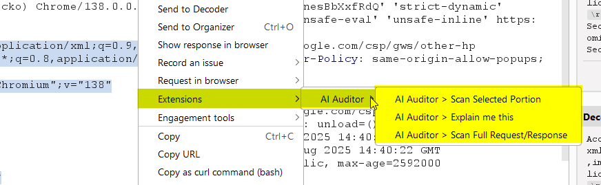</kbd>  

<kbd>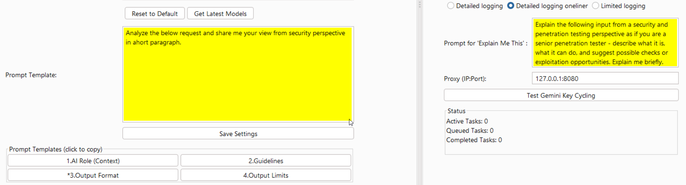</kbd>

</details>

> **Note:** A step-by-step walkthrough will be published soon on my external channels. Follow along here to get notified:
>
> * Medium: <https://vinay-infosec.medium.com/>
> * LinkedIn: <https://www.linkedin.com/in/vinay-vapt/>
>
> I’ll update this section with direct links once the articles go live.


## Features
### Core Capabilities
*   **Multi-provider models**: **OpenAI**, **Google Gemini**, **Anthropic Claude**, **OpenRouter**, and **xAI (Grok)**—plus **local** OpenAI-compatible endpoints (LM Studio and similar). Defaults and “Get Latest Models” keep the dropdowns current when API keys or the local server are configured.
*   **Two model slots**: **AI Model (automatic audits)** vs **AI Model (manual / PoC / Explain)** so you can use a small local or cheap model for background work and a stronger model for interactive analysis.
*   **Local LLM Support**: Connect to a local LM Studio (or compatible) server for privacy; optional **Proxy** (and **Repeater**) auto-audit uses the automatic-audit model when a **local** provider is selected.
*   **Passive & Scanner-triggered audits**: Optional AI review on **Burp Scanner issues**, optional **passive “all traffic”** mode (in-scope aware), with deduplication and batching where appropriate.
*   **Dynamic Model Loading**: Fetch and filter provider model lists; hide unwanted entries with **Hide these Models**.
*   **"Explain Me This" Feature**: Right-click selected text to get a detailed security explanation from the AI, which is then added as an informational finding in Burp's issue tracker.
*   **Detailed Vulnerability Reporting**: Vulnerability description, location, exploitation methods, severity levels (`HIGH`, `MEDIUM`, `LOW`, `INFORMATIVE`) and confidence levels (`CERTAIN`, `FIRM`, `TENTATIVE`).
*   **Custom Instructions**: Tailor the AI’s focus and analysis for special use cases.
*   **Rate Limiting**: Control the number of requests sent to APIs to avoid excessive costs.
*   **API Key Verification**: Verify API keys instantly within the extension.
*   **Integration with Burp Scanner**: Findings are automatically added to Burp’s issue tracker.
*   **Persistent Settings**: API keys and custom instructions will be saved and persist across sessions.
*   **Advanced UI Controls**:
    *   **Scrollable UI**: The main window is now scrollable, improving usability on smaller screens.
    *   **Status Panel**: Real-time monitoring of active, queued, and completed tasks.
    *   **Batch Size Control**: Tune performance by setting the number of concurrent requests (1-30).
    *   **Token Size Buttons**: Quickly set max token sizes (16K, 64K, 100K, 1M).
*   **Enhanced Logging**:
    *   **Three Logging Levels**: Choose between `Detailed`, `Detailed Oneliner`, and `Limited` logging for better troubleshooting.
    *   **Timestamped Logs**: All log entries now include a timestamp for easier analysis.
*   **Improved Workflow**:
    *   **Prompt Templates**: "Click-to-copy" buttons for common prompt sections to streamline analysis.
    *   **Gemini API Key Rotation**: Automatically cycle through multiple Gemini API keys when rate limits are hit.
    *   **Dynamic Prompt Augmentation**: Automatically adds formatting instructions to custom prompts to ensure results are correctly parsed and added to Burp's scanner.
*   **Networking & Performance**:
    *   **Proxy Support**: Route traffic through a specified proxy.
    *   **Batch Processing**: Fixed an issue with the batch pool size, now correctly processes up to 3 requests concurrently.
    *   **Token-Based Chunking**: Switched from chunk-based to token-based logic for more accurate request sizing.

## Prerequisites
### For General Usage
* **Operating System**: Windows, macOS, or Linux.
* **API Key** (or local endpoint): Configure at least one of:
  * [Anthropic](https://docs.anthropic.com/en/api/getting-started)
  * [Google Gemini](https://ai.google.dev/gemini/get_the_api_key) — generous free tier for trying the extension.
  * [OpenAI](https://platform.openai.com/docs/quickstart)
  * [OpenRouter](https://openrouter.ai/keys)
  * [xAI](https://docs.x.ai/) (Grok), or a **local** OpenAI-compatible URL (e.g. LM Studio) plus optional local API key.
* **Burp Suite Professional Edition** or **Burp Suite Enterprise Edition**
  * **NOTE**: Burp Suite Community Edition is currently not supported.

### Additional Requirements to Build from Source
* **Java Development Kit (JDK) 17** or later
* **Apache Maven**

## Installation

### Pre-built JAR (easiest)

**Download from the repo (always matches `main`):**  
[ **`releases/ai-auditor-jar-with-dependencies.jar`**](https://github.com/patrick-projects/AIAuditor/raw/main/releases/ai-auditor-jar-with-dependencies.jar) — use “Save link as…” if your browser opens it instead of downloading.

**Or** open **[Releases](https://github.com/patrick-projects/AIAuditor/releases/latest)** and grab the versioned `*-jar-with-dependencies.jar` attached there.

**Load in Burp:** **Extensions** → **Add** → **Java** → choose the downloaded JAR → **Next**.

Maintainers: after changing code, run `scripts/build-release-jar.sh`, commit the updated JAR under `releases/`, and push. To publish a tagged release with the same artifact, push a tag (for example `git tag v1.2.1 && git push origin v1.2.1`).

### Building from Source
#### Windows
1. Install JDK 17:
```
winget install Microsoft.OpenJDK.17
```
2. Install Apache Maven:
```
winget install Apache.Maven
```
3. Clone and Build:
```
git clone https://github.com/patrick-projects/AIAuditor.git
cd AIAuditor
mvn clean package
```
#### macOS
1. Install Homebrew:
```
/bin/bash -c "$(curl -fsSL https://raw.githubusercontent.com/Homebrew/install/HEAD/install.sh)"
```
2. Install JDK 17 and Maven:
```
brew install openjdk@17 maven
```
3. Clone and Build:
```
git clone https://github.com/patrick-projects/AIAuditor.git
cd AIAuditor
mvn clean package
```
#### Linux (Ubuntu/Debian)
1. Install JDK 17 and Maven:
```
sudo apt update
sudo apt install openjdk-17-jdk maven
```
2. Clone and Build:
```
git clone https://github.com/patrick-projects/AIAuditor.git
cd AIAuditor
mvn clean package
```

The compiled JAR will be available at `target/ai-auditor-1.2.0-jar-with-dependencies.jar`.

## Installation: Loading JAR in Burp Suite (Recommended)
1. Download **`ai-auditor-jar-with-dependencies.jar`** from [`releases/`](https://github.com/patrick-projects/AIAuditor/tree/main/releases) (or the [latest GitHub Release](https://github.com/patrick-projects/AIAuditor/releases/latest)), or build from source and use `target/ai-auditor-*-jar-with-dependencies.jar`.
2. Open **Burp Suite Professional** or **Enterprise** (Community is not supported; see FAQ).
3. Open the **Extender** tab → **Extensions** sub-tab.
4. Click **Add**, choose extension type **Java**, select the downloaded JAR, then **Next** to load.
5. Confirm **AI Auditor** appears under **Loaded** and open the **AI Auditor** tab in the main Burp window.

## Usage
### Initial Setup
1. Open the **AI Auditor** suite tab. Use the sub-tabs in order: **Connect** (keys and models), **Cheap local bulk** (high-volume automation — prefer LM Studio / cheap models), **Prompts** (optional wording), **Tuning** (retries and logging — skip at first).
2. On **Connect**, add API key(s) and/or a **Local LLM URL**. Use **Validate** next to each cloud key row, or **Validate** next to **Local LLM URL** for Ollama/LM Studio (optional **Local LLM API Key** if your server requires it).
3. Click **Get Latest Models**, pick **Cheap Local LLM (Bulk Proxied Traffic)** and **Premium Model for PoCs**, then **Save Settings**.
4. On **Cheap local bulk**, leave defaults unless you want Proxy/local browser analysis or full passive traffic; avoid premium cloud APIs in the bulk slot here or costs add up quickly.
5. **Prompts** and **Tuning** are optional until you need them.

### Analyzing Requests/Responses
#### Full Scan (Single Analysis)
1. Right-click a request or response in Burp Suite.
2. Select **Extensions** > **AI Auditor** > **Scan Full Request/Response**.

#### Analyze Selected Portion Only
1. In a request or a response, highlight the text you want to scan.
2. Right-click on your highlighted selection.
3. Select **Extensions** > **AI Auditor** > **Scan Selected Portion**.

#### Explain Me This
1. In a request or a response, highlight the text you want to understand.
2. Right-click on your highlighted selection.
3. Select **Extensions** > **AI Auditor** > **Explain me this**.
4. The explanation will be added as an informational finding in Burp's issue tracker.

### Review Results
Findings are displayed in Burp Scanner with detailed information.

## Usage Tips and Recommendations
### Avoid Scanning Large Responses
Large HTTP responses may exceed token limits and result in not only incomplete analysis but also degraded performance. Use the token size buttons to adjust the maximum token size for analysis.

### Customize Instructions Effectively
To get the best results from the AI Auditor, provide clear and specific instructions. For example:
* **Bad**: `Analyze and report everything that's bad security.`
* **Better**: `Identify and list all API endpoints found in the JavaScript file.`
* **Better**: `Only scan for XSS and SQLi. Do not scan for other issues.`

Use the "Click-to-copy" prompt templates to quickly build effective prompts.

## FAQ
**Why isn’t Burp Suite Community Edition supported?**

AI Auditor leans heavily on Burp Suite’s Scanner feature, and that’s a perk reserved for the Professional and Enterprise editions. Without it, the extension wouldn’t be able to tie findings neatly into Burp’s issue tracker or play nice with your existing workflows. It’s like trying to cook a gourmet meal on a campfire—it might work, but it won’t be pretty or efficient.

However, I am brainstorming ways to add support for Burp Suite Community Edition in the next release.

**How do I get valid API key(s) to use AI Auditor with my desired OpenAI, Google Gemini, or Anthropic model(s)?**

The steps are very easy and straightforward but a little different for each provider:
* **OpenAI (`gpt-4o`, `gpt-4o-mini`, `o1-preview`, `o1-mini`):** Follow OpenAI's [Quickstart guide](https://platform.openai.com/docs/quickstart) to sign up and generate your API key.  
* **Google (`gemini-1.5-pro`, `gemini-1.5-flash`):** Follow the instructions on Google's [Gemini API documentation](https://ai.google.dev/gemini/get_the_api_key) to set up access and retrieve your key.  
* **Anthropic (`claude-3-5-sonnet-latest`, `claude-3-5-haiku-latest`, `claude-3-opus-latest`):** Visit Anthropic's [Getting Started guide](https://docs.anthropic.com/en/api/getting-started) for detailed steps to acquire an API key.
* **OpenRouter:** Get your API key from the [OpenRouter Keys page](https://openrouter.ai/keys).

**VERY IMPORTANT**: While **AI Auditor** itself is free (you're welcome!), you are ultimately responsible for any costs incurred from using the associated APIs. Each provider has its own pricing structure, which you can find in the respective documentation for each.

For the budget-conscious, I'd recommend trying Gemini first, since Google surprisingly offers a generous free tier. (No I don't work for Google.)


**What should I do if I encounter bugs or crashes?**

Please open a new issue. Include as much detail as possible—what you were doing, what went wrong, and any error messages you saw. The more I know, the faster I can fix it. Feedback is invaluable, and I genuinely appreciate users who take the time to report problems.

**Why are false positives or false negatives possible?**

AI models aren’t perfect—they’re probabilistic, not deterministic. This means they rely on patterns, probabilities, and sometimes a little educated guessing. Misinterpretations can happen, especially when instructions or context are vague. To minimize these hiccups, be specific in your instructions and provide clear, relevant data. The better the input, the sharper the output. Still, it’s always a good idea to double-check the findings before acting on them.

## Disclaimer

I am providing **AI Auditor** *as-is* ***strictly*** for educational and testing purposes. By using this tool, you agree that you will do so in accordance with all applicable laws of whatever jurisdiction you're in and the terms of service for the APIs used. If you're a criminal, please don't use this tool.

## License

This project is licensed under the GNU Affero General Public License v3.0.


